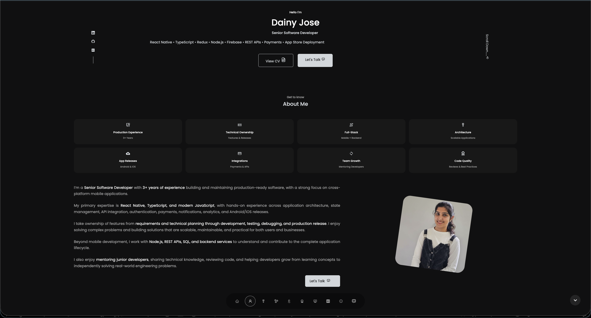

# Dainy Jose | Portfolio

---

 

---

## About

Hi! I’m **Dainy Jose**, a **Hybrid App & Full-Stack Developer** specialized in **React Native, React, and MERN Stack**.  
This portfolio showcases my **projects, POCs, blogs, skills, and contact info** in a modern and interactive interface.

---

## Technologies

- **Frontend:** React, TypeScript, Vite
- **UI/Design:** CSS, React Icons, SwiperJS
- **Forms/Email:** EmailJS
- **Deployment:** GitHub Pages

---

## Features

- Responsive design (desktop & mobile)
- Projects, POCs, and blog showcases
- Skills & experience sections
- Contact form integrated with EmailJS
- Smooth scroll navigation & animations
- GitHub Pages deployment ready

---

## Live Preview

Check it out: [https://dainyjose.github.io/my-portfolio/](https://dainyjose.github.io/my-portfolio/)

---

## 🧑‍💻 Author

**Dainy Jose**  
[GitHub](https://github.com/dainyjose) | [LinkedIn](https://linkedin.com/in/dainyjose)

---

## License

© 2026 Dainy Jose. All rights reserved.

This portfolio, including its source code, design, content, images, resume, personal branding assets, and associated materials, is provided for viewing and reference purposes only.

No permission is granted to copy, modify, redistribute, republish, host, deploy, sublicense, or create derivative works from this project without prior written permission from the author.

Unauthorized use of any part of this repository may result in copyright enforcement actions.
