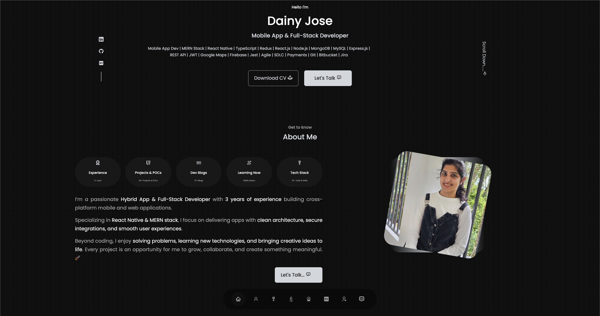

# Dainy Jose | Portfolio

---



<div align="center">

[](https://www.linkedin.com/in/dainyjose/)
[](https://dev.to/dainy_jose)
[](https://github.com/dainyjose)

 </div>

---

## About

Hi! I’m **Dainy Jose**, a **Hybrid App & Full-Stack Developer** specialized in **React Native, React, and MERN Stack**.  
This portfolio showcases my **projects, POCs, blogs, skills, and contact info** in a modern and interactive interface.

---

## Technologies

- **Frontend:** React, TypeScript, Vite
- **UI/Design:** CSS, React Icons, SwiperJS
- **Forms/Email:** EmailJS
- **Deployment:** GitHub Pages

---

## Features

- Responsive design (desktop & mobile)
- Projects, POCs, and blog showcases
- Skills & experience sections
- Contact form integrated with EmailJS
- Smooth scroll navigation & animations
- GitHub Pages deployment ready

---

## Live Preview

Check it out: [https://dainyjose.github.io/my-portfolio/](https://dainyjose.github.io/my-portfolio/)

---

## Installation

Clone the repository:

```bash
git clone https://github.com/dainyjose/my-portfolio.git
cd my-portfolio
```

Install dependencies:

```bash
  bun install
```

---

## Usage

Run the development server:

```bash
  bun run dev
```

Open in browser:

```bash
http://localhost:5173/
```

Build for production:

```bash
bun run build
```

Preview production build locally:

```bash
bun run preview
```

---

## Deployment

To deploy on GitHub Pages:

```bash
bun run deploy
```

## 🧑‍💻 Author

**Dainy Jose**  
[GitHub](https://github.com/dainyjose) | [LinkedIn](https://linkedin.com/in/dainyjose)

---
